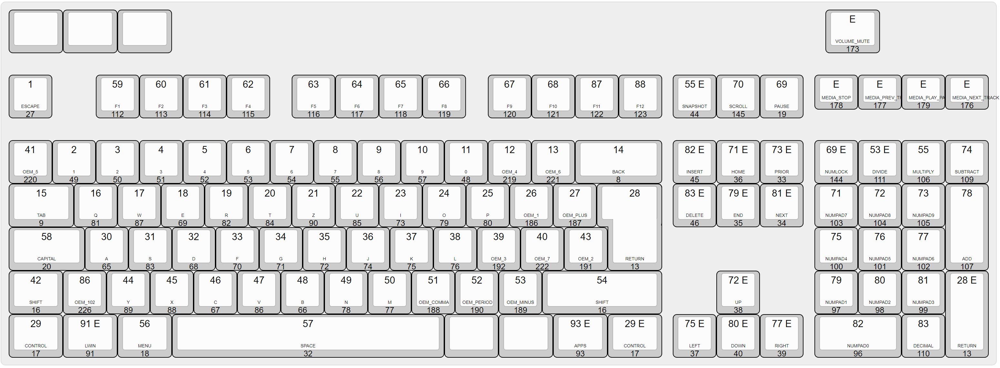

# klc

Scancode and VK mapping (created [here](http://keyboard-layout-editor.com/##@@_a:7&w:1.25&h:0.8%3B&=&_w:1.25&h:0.8%3B&=&_w:1.25&h:0.8%3B&=&_x:15&a:5&w:1.25&h:0.8%3B&=E%0AVOLUME%2F_MUTE%0A%0A%0A173%3B&@_y:0.5%3B&=1%0AESCAPE%0A%0A%0A27&_x:1%3B&=59%0AF1%0A%0A%0A112&=60%0AF2%0A%0A%0A113&=61%0AF3%0A%0A%0A114&=62%0AF4%0A%0A%0A115&_x:0.5%3B&=63%0AF5%0A%0A%0A116&=64%0AF6%0A%0A%0A117&=65%0AF7%0A%0A%0A118&=66%0AF8%0A%0A%0A119&_x:0.5%3B&=67%0AF9%0A%0A%0A120&=68%0AF10%0A%0A%0A121&=87%0AF11%0A%0A%0A122&=88%0AF12%0A%0A%0A123&_x:0.25%3B&=55%20E%0ASNAPSHOT%0A%0A%0A44&=70%0ASCROLL%0A%0A%0A145&=69%0APAUSE%0A%0A%0A19&_x:0.25&h:0.8%3B&=E%0AMEDIA%2F_STOP%0A%0A%0A178&_h:0.8%3B&=E%0AMEDIA%2F_PREV%2F_TRACK%0A%0A%0A177&_h:0.8%3B&=E%0AMEDIA%2F_PLAY%2F_PAUSE%0A%0A%0A179&_h:0.8%3B&=E%0AMEDIA%2F_NEXT%2F_TRACK%0A%0A%0A176%3B&@_y:0.5%3B&=41%0AOEM%2F_5%0A%0A%0A220&=2%0A1%0A%0A%0A49&=3%0A2%0A%0A%0A50&=4%0A3%0A%0A%0A51&=5%0A4%0A%0A%0A52&=6%0A5%0A%0A%0A53&=7%0A6%0A%0A%0A54&=8%0A7%0A%0A%0A55&=9%0A8%0A%0A%0A56&=10%0A9%0A%0A%0A57&=11%0A0%0A%0A%0A48&=12%0AOEM%2F_4%0A%0A%0A219&=13%0AOEM%2F_6%0A%0A%0A221&_w:2%3B&=14%0ABACK%0A%0A%0A8&_x:0.25%3B&=82%20E%0AINSERT%0A%0A%0A45&=71%20E%0AHOME%0A%0A%0A36&=73%20E%0APRIOR%0A%0A%0A33&_x:0.25%3B&=69%20E%0ANUMLOCK%0A%0A%0A144&=53%20E%0ADIVIDE%0A%0A%0A111&=55%0AMULTIPLY%0A%0A%0A106&=74%0ASUBTRACT%0A%0A%0A109%3B&@_w:1.5%3B&=15%0ATAB%0A%0A%0A9&=16%0AQ%0A%0A%0A81&=17%0AW%0A%0A%0A87&=18%0AE%0A%0A%0A69&=19%0AR%0A%0A%0A82&=20%0AT%0A%0A%0A84&=21%0AZ%0A%0A%0A90&=22%0AU%0A%0A%0A85&=23%0AI%0A%0A%0A73&=24%0AO%0A%0A%0A79&=25%0AP%0A%0A%0A80&=26%0AOEM%2F_1%0A%0A%0A186&=27%0AOEM%2F_PLUS%0A%0A%0A187&_x:0.25&w:1.25&h:2&w2:1.5&h2:1&x2:-0.25%3B&=28%0ARETURN%0A%0A%0A13&_x:0.25%3B&=83%20E%0ADELETE%0A%0A%0A46&=79%20E%0AEND%0A%0A%0A35&=81%20E%0ANEXT%0A%0A%0A34&_x:0.25%3B&=71%0ANUMPAD7%0A%0A%0A103&=72%0ANUMPAD8%0A%0A%0A104&=73%0ANUMPAD9%0A%0A%0A105&_h:2%3B&=78%0AADD%0A%0A%0A107%3B&@_w:1.75%3B&=58%0ACAPITAL%0A%0A%0A20&=30%0AA%0A%0A%0A65&=31%0AS%0A%0A%0A83&=32%0AD%0A%0A%0A68&=33%0AF%0A%0A%0A70&=34%0AG%0A%0A%0A71&=35%0AH%0A%0A%0A72&=36%0AJ%0A%0A%0A74&=37%0AK%0A%0A%0A75&=38%0AL%0A%0A%0A76&=39%0AOEM%2F_3%0A%0A%0A192&=40%0AOEM%2F_7%0A%0A%0A222&=43%0AOEM%2F_2%0A%0A%0A191&_x:4.75%3B&=75%0ANUMPAD4%0A%0A%0A100&=76%0ANUMPAD5%0A%0A%0A101&=77%0ANUMPAD6%0A%0A%0A102%3B&@_w:1.25%3B&=42%0ASHIFT%0A%0A%0A16&=86%0AOEM%2F_102%0A%0A%0A226&=44%0AY%0A%0A%0A89&=45%0AX%0A%0A%0A88&=46%0AC%0A%0A%0A67&=47%0AV%0A%0A%0A86&=48%0AB%0A%0A%0A66&=49%0AN%0A%0A%0A78&=50%0AM%0A%0A%0A77&=51%0AOEM%2F_COMMA%0A%0A%0A188&=52%0AOEM%2F_PERIOD%0A%0A%0A190&=53%0AOEM%2F_MINUS%0A%0A%0A189&_w:2.75%3B&=54%0ASHIFT%0A%0A%0A16&_x:1.25%3B&=72%20E%0AUP%0A%0A%0A38&_x:1.25%3B&=79%0ANUMPAD1%0A%0A%0A97&=80%0ANUMPAD2%0A%0A%0A98&=81%0ANUMPAD3%0A%0A%0A99&_h:2%3B&=28%20E%0ARETURN%0A%0A%0A13%3B&@_w:1.25%3B&=29%0ACONTROL%0A%0A%0A17&_w:1.25%3B&=91%20E%0ALWIN%0A%0A%0A91&_w:1.25%3B&=56%0AMENU%0A%0A%0A18&_w:6.25%3B&=57%0ASPACE%0A%0A%0A32&_a:7&w:1.25%3B&=&_w:1.25%3B&=&_a:5&w:1.25%3B&=93%20E%0AAPPS%0A%0A%0A93&_w:1.25%3B&=29%20E%0ACONTROL%0A%0A%0A17&_x:0.25%3B&=75%20E%0ALEFT%0A%0A%0A37&=80%20E%0ADOWN%0A%0A%0A40&=77%20E%0ARIGHT%0A%0A%0A39&_x:0.25&w:2%3B&=82%0ANUMPAD0%0A%0A%0A96&=83%0ADECIMAL%0A%0A%0A110))

